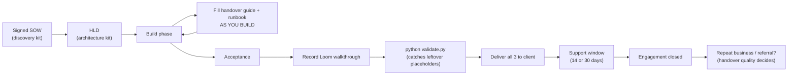
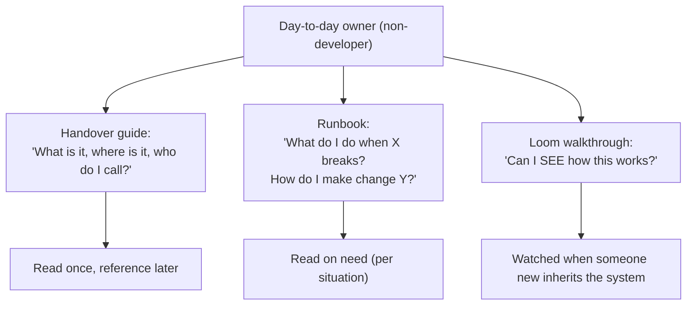
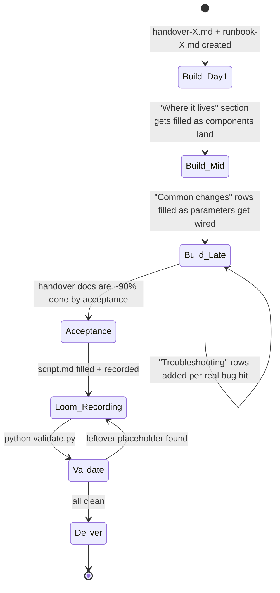
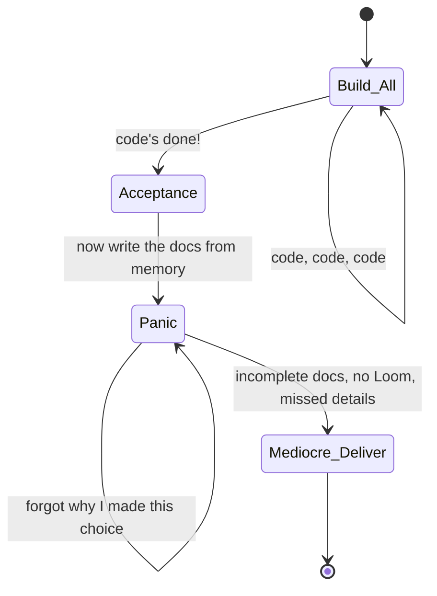
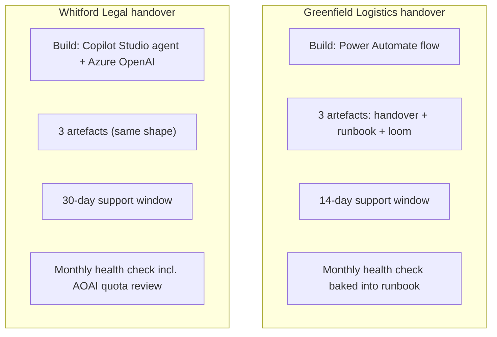

# Diagrams

This is a templates kit — the diagrams here are about how the handover
fits into an engagement, not about a runnable system.

## 1. Where the handover sits in the engagement lifecycle

The diagram makes one point: the handover is where repeat business and
five-star reviews are won or lost. Treat it as the deliverable, not the
afterthought.

## 2. The three artefacts — what each answers

## 3. The "fill as you build" workflow (the leverage move)

Compared to the alternative ("docs at the end"):

## 4. Two worked engagements at a glance

Same pack structure; different scale of engagement.
