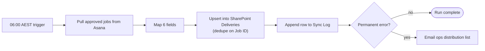

# Handover guide — Greenfield Logistics: Asana → SharePoint daily sync

**Delivered to:** Greenfield Logistics Pty Ltd · **By:** Derek G. · **Date:** 2026-08-05

## What was built
A Power Automate flow that runs every weekday at 06:00 AEST, pulls jobs
approved in the Asana "Dispatch" project on the previous business day, and
writes them as rows in the SharePoint "Deliveries" list (deduped by Job ID).
Every run lands a status row in the "Sync Log" SharePoint list, and any
permanent failure emails the ops distribution list. This replaces the
manual 30-minute morning copy Cara was doing.

**Walkthrough video:** https://www.loom.com/share/example-greenfield-logistics-handover

## How it works (at a glance)

1. Trigger fires → 2. Pull approved jobs from Asana → 3. Map fields → 4.
Upsert into SharePoint (skip duplicates) → 5. Log + notify on failure.

## Where it lives
| Thing | Location |
|-------|----------|
| The flow | Power Automate → My flows → "Greenfield — Asana to SharePoint daily sync" |
| Source data | Asana → Workspace "Greenfield Ops" → Project "Dispatch" |
| Output | SharePoint → /sites/ops → "Deliveries" list |
| Run log | SharePoint → /sites/ops → "Sync Log" list |
| Notification distribution list | `ops-alerts@greenfieldlogistics.com.au` (managed in Outlook) |
| Asana connection | OAuth on Cara Naidoo's Power Automate account |

## How to monitor it
- **Is it running?** Power Automate → flow → Run history. Green = success.
  You should see one run per weekday between 06:00 and 06:02 AEST.
- **Where do failures show up?**
  1. Email to `ops-alerts@greenfieldlogistics.com.au`.
  2. A row with `status = "failed"` in the "Sync Log" list (filter for
     last 7 days).
- **Normal schedule:** every weekday at 06:00 AEST; ~30–60 seconds per run
  at typical volumes (~25–60 rows).
- **Quiet days are real.** If the previous business day had no approved jobs,
  the run still happens and logs `rows_pulled = 0, rows_created = 0`.

## If something looks wrong
See the [runbook](runbook-greenfield-logistics.md) for common fixes. Quick
checks:
- [ ] Did Asana have approved jobs yesterday? (open Asana → Dispatch → filter)
- [ ] Is the Asana connection still authorized? (Power Automate → Connections)
- [ ] Any failed runs in history? Open the latest one to see the step that
      failed.
- [ ] If the failure looks like a column rename in Asana, contact me — the
      field map needs updating.

## Who to contact
- Day-to-day owner: Cara Naidoo (`cara.naidoo@greenfieldlogistics.com.au`)
- Backup owner during Cara's leave: Marcus Reed (`marcus.reed@…`) — also on
  the alert distribution list.
- Builder (me): `derekgallardo01@gmail.com` — support window: 14 calendar
  days post-go-live (through **2026-08-19**). Anything beyond that is a
  change request per SOW §7.
