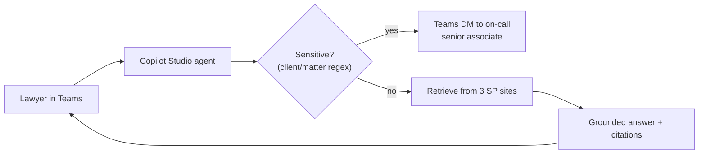

# Handover guide — Whitford Legal: Copilot Studio knowledge agent

**Delivered to:** Whitford Legal LLP · **By:** Derek G. · **Date:** 2026-09-30

## What was built
A Copilot Studio agent in Microsoft Teams that answers partners' and
associates' questions from three SharePoint sites (Policies, Precedents,
Billing Procedures) with source citations. Questions that mention an active
client name or matter number escalate to the on-call senior associate via a
Teams DM instead of being answered. The 80-case golden eval set lives in
the firm's `wlf-copilot-pilot` repo and gates any future changes.

**Walkthrough video:** https://www.loom.com/share/example-whitford-legal-handover

## How it works (at a glance)

1. Lawyer asks in Teams → 2. Sensitive-topic check → 3a. If sensitive, DM
the on-call → 3b. Otherwise retrieve from the three SharePoint sites → 4.
Grounded answer with `[Document – Section]` citations → 5. Reply in Teams.

## Where it lives
| Thing | Location |
|-------|----------|
| The agent | Copilot Studio → Agents → "WLF Knowledge Agent" |
| Knowledge sources | `/sites/policies`, `/sites/precedents`, `/sites/billing-procedures` |
| Sensitive-topic list (client/matter keywords + regex) | SharePoint list "WLF Sensitive Topics" in `/sites/intranet-it` |
| On-call rotation | SharePoint list "WLF KM On-call" in `/sites/intranet-it` (column: ISO week, senior associate, Teams id) |
| Eval golden set | `wlf-copilot-pilot` private repo, `evals/golden.json` |
| Azure OpenAI resource | Subscription "WLF Pilot", resource group `wlf-aoai-pilot`, deployment `gpt-4o` |
| Service principal (escalation DM) | App registration `wlf-rag-pilot-escalation` |

## How to monitor it
- **Is it running?** Copilot Studio → analytics → Sessions over time should
  show a healthy daily curve (target ≥30 / day at full adoption).
- **Where do failures show up?** The agent's Topics → "Sensitive-topic
  escalation" path logs every escalation to a SharePoint list "WLF KM
  Escalations" — that's where the on-call sees them too.
- **Eval pass rate:** the CI badge on `wlf-copilot-pilot` shows the 80-case
  eval status. Anything below 100% blocks PR merges by design.
- **Azure OpenAI quota:** check the Azure portal → `wlf-aoai-pilot` →
  Metrics → "Processed Inference Tokens". Approved throughput is well
  above projected need.

## If something looks wrong
See the [runbook](runbook-whitford-legal.md). Quick checks:
- [ ] Eval pass rate < 100%? Look at the failing PR / CI run.
- [ ] An escalation didn't fire when expected? Check the sensitive-topics
      SharePoint list — was the new client name added there?
- [ ] No analytics for the last 24h? Check the Copilot Studio agent is
      still published to Teams (Publish → Channels → Teams).
- [ ] Wrong document cited repeatedly? Run a fresh re-index of the
      affected SharePoint site from the Copilot Studio agent's Knowledge
      page.

## Who to contact
- **KM partner (product owner):** J. Whitford (`j.whitford@whitfordlegal.com`)
- **IT lead (infra):** D. Park (`d.park@whitfordlegal.com`)
- **On-call senior associate (this week):** see "WLF KM On-call" list
- **Builder (me):** `derekgallardo01@gmail.com` — support window: 30
  calendar days post-go-live (through **2026-10-30**). Anything beyond is
  a change request per SOW §7.
